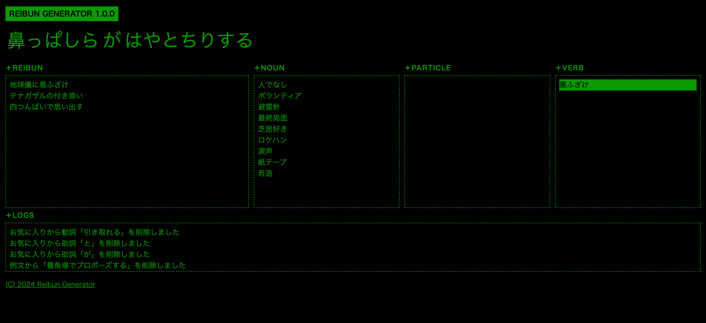

# REIBUN GENERATOR



Reibun Generator is a web browser application primarily designed for local use, focused on generating Japanese example sentences. This application, built using `Node.js`, is optimized for PC use and is intended to be operated mainly through keyboard interactions.

## Installation

To set up the application on your local environment, follow these steps:

### Clone the repository

First, clone the repository to your local machine:

```bash
git clone https://github.com/idutsu/reibun-generator.git
```

### Prerequisites

Before proceeding, ensure that `Node.js` is installed on your system. If you do not have Node.js installed, you can download and install it from [Node.js official website](https://nodejs.org/en).

### Install dependencies

Navigate to the application directory and install the required dependencies:

```bash
cd reibun-generator
npm install
```

### Start the application

Run the application using the following command:

```bash
npm start
```

By default, the server will start on port 3000. You can access the application by navigating to `http://localhost:3000` in your web browser.

## Application Structure

Reibun Generator is composed of three main areas:

### Reibun Area

This is where you create Japanese example sentences. The sentences are composed of three types of words: nouns, particles, and verbs. By randomly changing these words, you can create simple yet unexpected Japanese example sentences.

### Favorites Area

This area is for saving words from the Reibun Area. (Note that these are not saved to a database, so they will be lost when the browser is refreshed.)

### Search Area

This area displays potential word suggestions when editing a word in the Reibun Area.

## Japanese Dictionaries

This application uses `IPA Dictionary` and  `Japanese Wordnet` to create example sentences :

- [`noun.csv`](https://github.com/idutsu/reibun-generator/tree/main/csv/noun.csv): Contains nouns and their readings.
- [`part.csv`](https://github.com/idutsu/reibun-generator/tree/main/csv/part.csv): Contains particles.
- [`verb.csv`](https://github.com/idutsu/reibun-generator/tree/main/csv/verb.csv): Contains verbs and their readings.

## Usage

This application is designed to be used with a keyboard only, without the need for a mouse. Here are the key functionalities:

- Selected words are highlighted in green.
- `F` Switch the selected word(Noun/Particle/Verb) in the Reibun Area.
- `A` In the Reibun Area, switch all the words.
- `R` Select the Reibun Area.
- `N` Select the Favorite Noun Area.
- `P` Select the Favorite Particle Area.
- `V` Select the Favorite Verb Area.
- `↑` `↓` Select the next/prev word.
- `Enter`
    - In the Reibun Area, it will be replaced with a random word from the dictionary.
    - In the Favorites Area or the Search Area, it will be used to replace the word in the sentence.
- `Space` Save the example sentence.
- `S` Save the selected word in the Reibun Area to the Favorites Area.
- `E`
    - In the Reibun Area, edit that word.
    - While typing, the Search Area shows potential matching words.
- `ESC` Finish editing a word.
- `Delete`
    - In the Reibun Area or the Search Area, delete the word form the dictionary.
    - In the Favorites Area, remove the selected word from your favorites.
- `D` In the Reibun Area, add the selected word to the dictionary.
